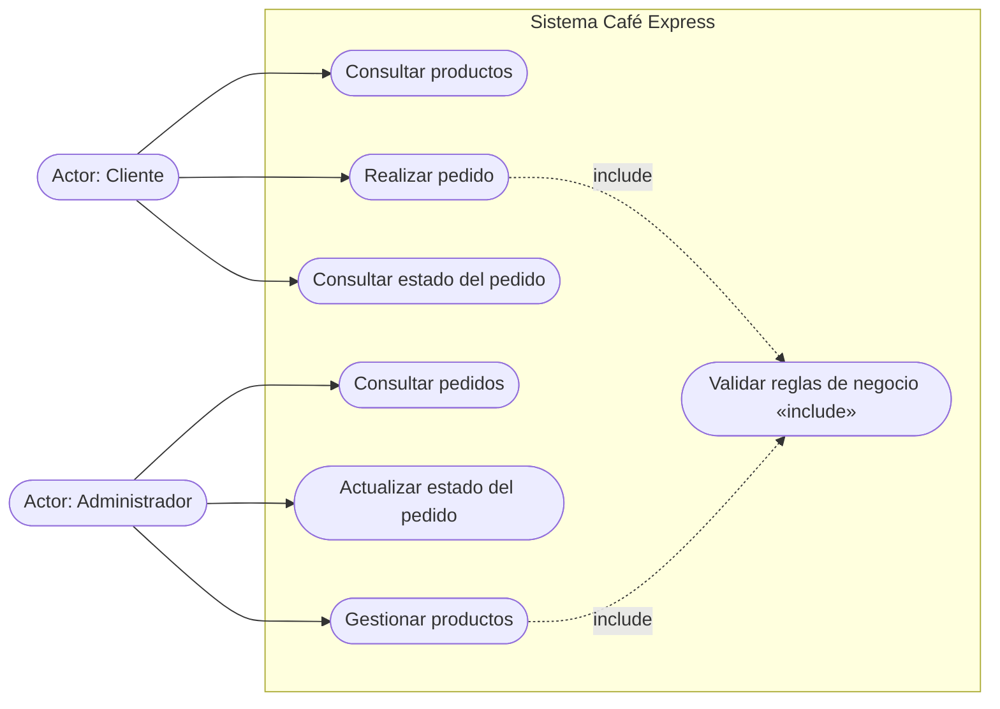
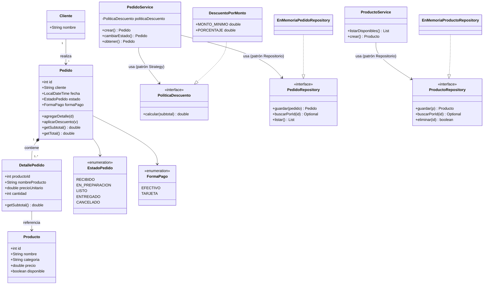
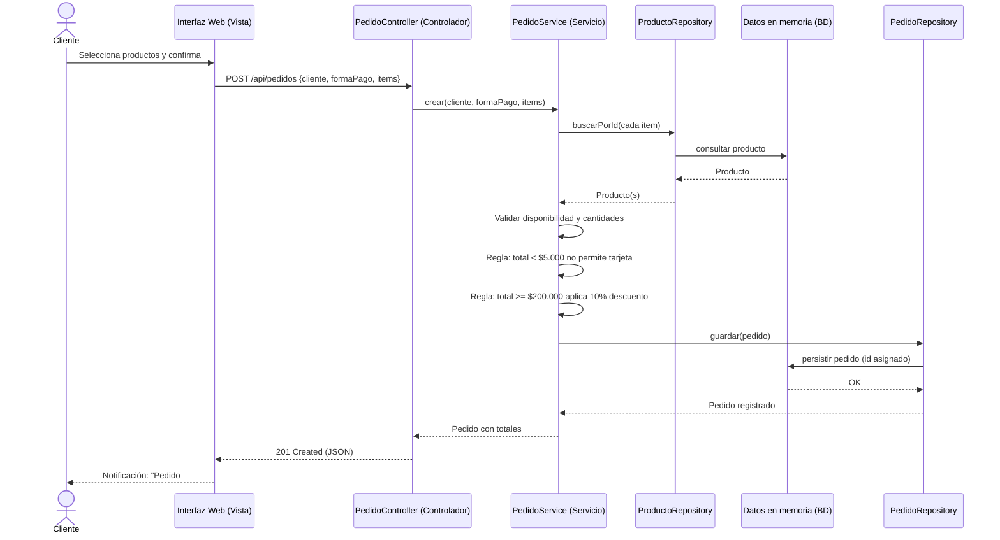
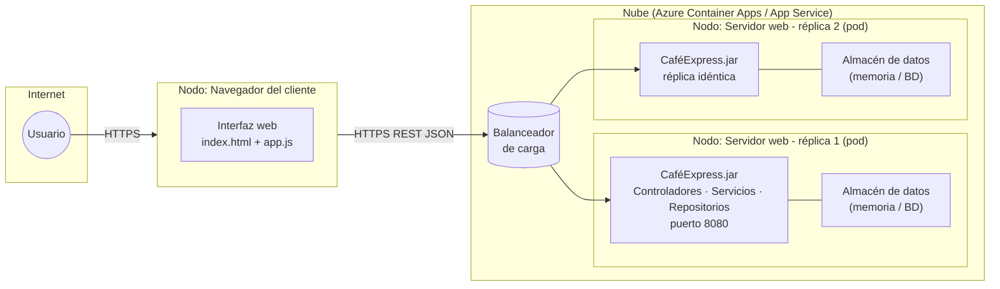

# 2. Diseño de la arquitectura mediante UML

> Los diagramas están en sintaxis **Mermaid**: se renderizan automáticamente en GitHub, VS Code
> (extensión Mermaid) o https://mermaid.live. Cada diagrama incluye su descripción y justificación.

## 2.1 Diagrama de casos de uso

**Descripción:** el *Cliente* consulta el catálogo, realiza pedidos y consulta su estado; el
*Administrador* consulta y actualiza pedidos y gestiona el catálogo de productos.

**Relevancia arquitectónica:** define la frontera del sistema y los actores antes de diseñar.
De él se derivan directamente los módulos de la capa de presentación (una pantalla por caso de uso)
y los endpoints REST, garantizando trazabilidad entre requisitos y componentes.

## 2.2 Diagrama de clases

**Descripción:** `Pedido` agrega uno o más `DetallePedido` que referencian un `Producto`. La lógica
vive en los servicios (`PedidoService`, `ProductoService`); el acceso a datos queda detrás de las
interfaces `PedidoRepository` / `ProductoRepository`; la regla de descuento se encapsula en la
estrategia `PoliticaDescuento`.

**Relevancia arquitectónica:** muestra **quién es responsable de qué** (separación de responsabilidades)
y hace visible el desacoplamiento: cambiar la base de datos solo implica otra implementación de
repositorio, sin tocar servicios ni controladores.

## 2.3 Diagrama de secuencia — Realizar pedido

**Descripción:** recorre el flujo completo desde la acción del usuario hasta la persistencia y la
notificación de confirmación, evidenciando las capas Vista → Controlador → Servicio → Repositorio → Datos.

**Relevancia arquitectónica:** demuestra que cada mensaje cruza una sola frontera por capa; si algo
falla (regla incumplida), el servicio responde y el controlador traduce a HTTP 422 — la interfaz nunca
habla directo con los datos.

## 2.4 Diagrama de despliegue

**Descripción:** el navegador ejecuta la vista; las peticiones HTTPS llegan al balanceador de carga de
la plataforma en la nube, que distribuye entre réplicas idénticas (pods) de la aplicación; cada réplica
accede a su almacén de datos (en memoria para el prototipo, base de datos administrada en producción).

**Relevancia arquitectónica:** documenta **dónde se ejecuta cada componente** y cómo crece el sistema:
escalar horizontalmente = agregar réplicas/pods sin reconstruir nada; escalar verticalmente = aumentar
RAM/CPU del nodo. Como el JAR no tiene dependencias nativas, la misma imagen corre igual en local o en la nube.
